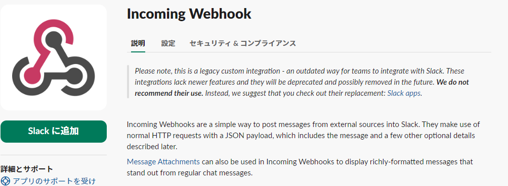

# Slow Query Monitor

## 概要

Slow Query Monitorは、データベース内のスロークエリを検出し、Slackへ通知を行うツールです。master-slave構成のデータベースに対応しており、効率的なデータベース監視を可能にします。

## 主な機能

- マスター・スレーブ構成のデータベースでのスロークエリ検出
- 検出したスロークエリのSlack通知（Incoming Webhookを使用）
- 環境変数を使用した柔軟な設定

## 必要条件

- Go 1.22.0 以上
- Oracle Database（64bit）
- Slackワークスペースと Incoming Webhook URL

## 使用方法

基本的な使用方法：

```
main [-env="{envファイルパス}"]
```

`-env` オプションを使用して、カスタム環境変数ファイルを指定できます。デフォルトは `.env` です。

例：
```
main -env="./config/production.env"
```

## 設定オプション

`.env` ファイルで設定可能な主なオプション：

- `DB_USER`: データベースユーザー名
- `DB_PASS`: データベースパスワード
- `DB_HOST`: マスターデータベースのホスト
- `DB_HOST_SLAVE`: スレーブデータベースのホスト
- `DB_PORT`: データベースポート
- `DB_SERVICE`: データベースサービス名
- `SLACK_WEBHOOK_ENDPOINT`: Slack Incoming Webhook URL

## Slack通知

Slack通知には Incoming Webhook を使用します。設定方法は以下の通りです：

1. Slackワークスペースで新しい Incoming Webhook を作成します。
2. 生成されたWebhook URLを `.env` ファイルの `SLACK_WEBHOOK_ENDPOINT` に設定します。




## ビルド

2. 依存関係のインストール：
   ```
   go mod tidy
   go build main.go
   ```

3. 環境変数の設定：
   `.env.example` ファイルを `.env` にコピーし、必要な情報を入力します。

   ```
   cp .env.example .env
   ```

   `.env` ファイルを編集し、データベース接続情報とSlack Webhook URLを設定します。
